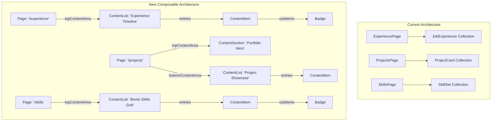
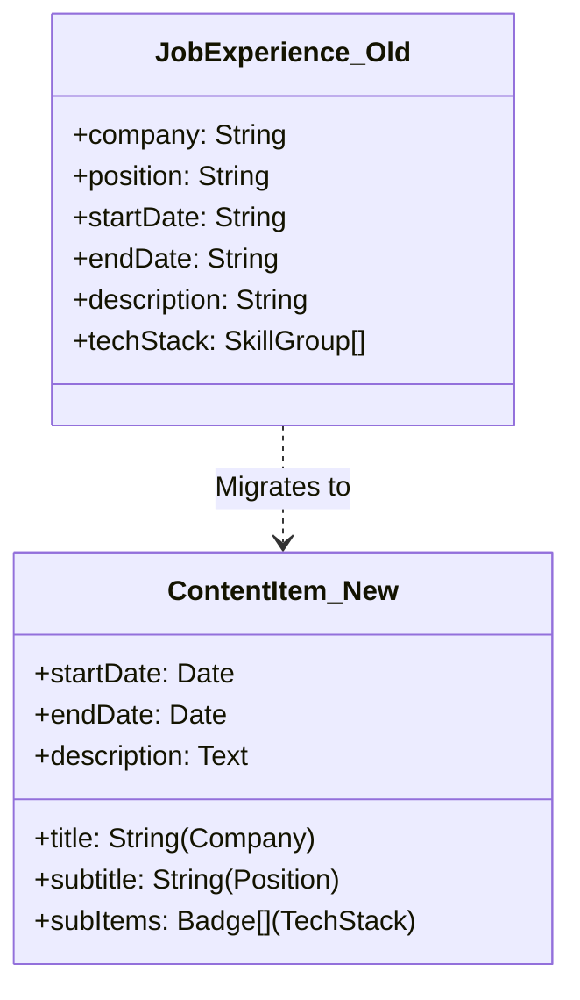
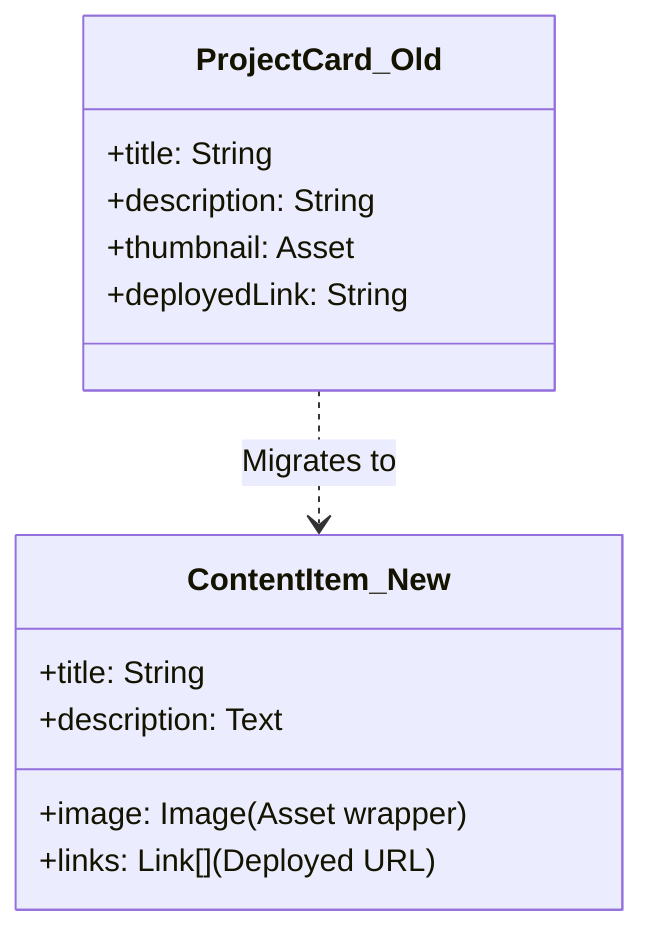
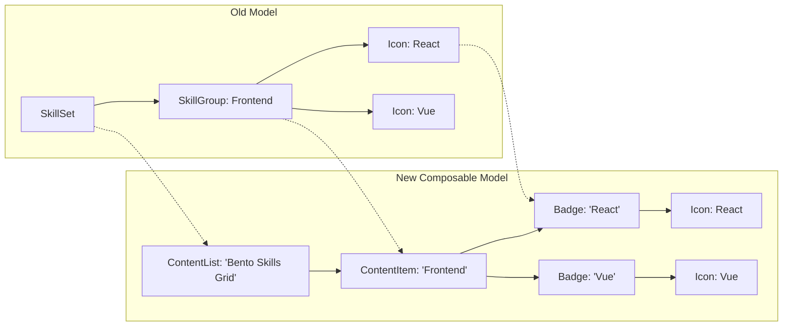

# Content Model Mapping Diagrams

This document visualizes the transition from our current highly-specific Contentful models to the new composable architecture.

## 1. High-Level Architecture Shift

The old architecture required specific page types and globally fetched collections. The new architecture uses a single generic `page` type that constructs itself out of `contentList` sections.

## 2. Job Experience Entity Mapping

In the current model, `JobExperience` was its own distinct Content Type. In the new model, we use a generic `ContentItem` where the specific data is mapped to generic fields, and the `techStack` is represented by `Badge` items.

## 3. Project Card Entity Mapping

Similarly, `ProjectCard` fields map cleanly to the generic presentation fields of a `ContentItem`.

## 4. Skills Entity Mapping

The `SkillSet` is a complex nested structure. In the new model, the parent `SkillSet` becomes a `ContentList` configured to render as a "Bento Skills Grid". The `SkillGroup` becomes a generic `ContentItem` acting as a category, and the actual skills become `Badge`s.

## Summary of Field Mappings

To implement the "Block Renderer" (frontend adapter), the mapping layer will translate generic API responses into component-specific props using these rules:

| Current Schema | Generic Field (`ContentItem`) | Notes |
|---|---|---|
| `company` | `title` | |
| `position` | `subtitle` | |
| `description` | `description` / `body` | Use `body` (Rich Text) for multi-paragraph |
| `techStack` | `subItems` | An array of `Badge` references |
| `thumbnail` | `image` | Maps to the internal `Image` wrapper |
| `deployedLink`| `links` | Array of `Link` wrappers |
