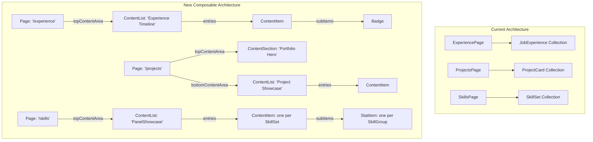
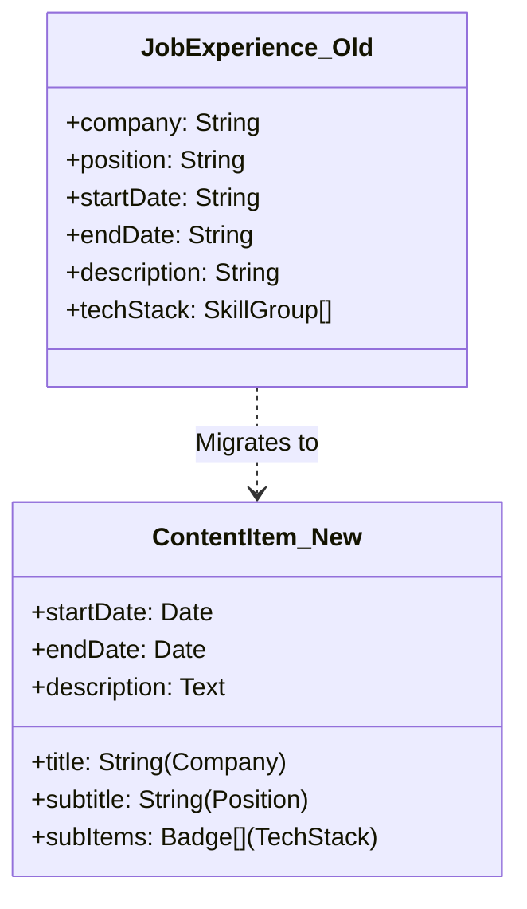
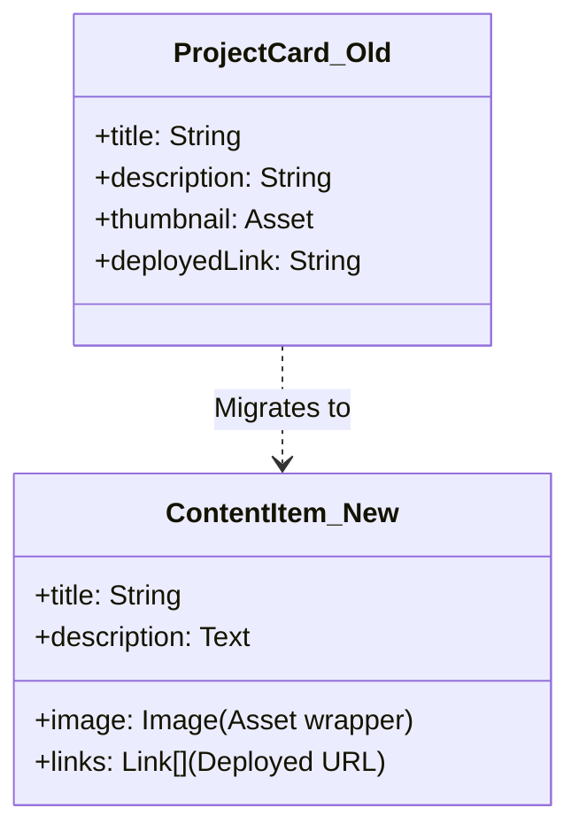
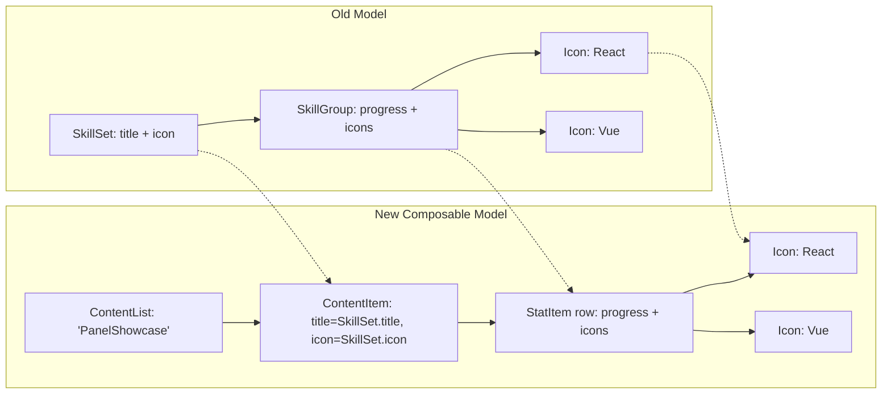

# Content Model Mapping Diagrams

This document visualizes the transition from our current highly-specific Contentful models to the new composable architecture.

> **Note (2026-09-06):** this document captures the original design intent (ADR-0003). For the
> migration-verified field-by-field mapping — checked against what the legacy and target frontends
> actually render, not just the schema shape — see
> [`legacy-space-migration-field-mapping.md`](../contentful/legacy-space-migration-field-mapping.md) and
> [ADR-0019](../adr/0019-legacy-space-cross-schema-content-migration.md). A few details below (the
> `"Bento Skills Grid"` UI name, and `JobExperience.techStack`'s mapping to `subItems`) turned out to
> differ from what actually ships — §4 below is corrected; the Job Experience diagram in §2 and the field
> table at the bottom are not, and should be read as illustrative rather than authoritative.

## 1. High-Level Architecture Shift

The old architecture required specific page types and globally fetched collections. The new architecture uses a single generic `page` type that constructs itself out of `contentList` sections.

## 2. Job Experience Entity Mapping

In the current model, `JobExperience` was its own distinct Content Type. In the new model, we use a generic `ContentItem` where the specific data is mapped to generic fields, and the `techStack` is represented by `Badge` items.

## 3. Project Card Entity Mapping

Similarly, `ProjectCard` fields map cleanly to the generic presentation fields of a `ContentItem`.

## 4. Skills Entity Mapping

**Corrected 2026-09-06 (see [ADR-0019](../adr/0019-legacy-space-cross-schema-content-migration.md)):** an
earlier version of this diagram put the panel at the `SkillGroup` level, reasoning that a `PanelShowcase`
row needs a label to stay visible. Checking production's actual `skills/page.tsx` showed that's wrong —
`SkillGroup.title` is never rendered there, only used as a React key. Production's real heading is one
per `SkillSet` (icon + title, both rendered), with each `SkillGroup` as one *unlabeled* progress-bar row
underneath. The `ContentList` renders as `PanelShowcase` (not "Bento Skills Grid", which was never
actually deployed), with the panel at the `SkillSet` level:

## Summary of Field Mappings

To implement the "Block Renderer" (frontend adapter), the mapping layer will translate generic API responses into component-specific props using these rules:

| Current Schema | Generic Field (`ContentItem`) | Notes |
|---|---|---|
| `company` | `title` | |
| `position` | `subtitle` | |
| `description` | `description` / `body` | Use `body` (Rich Text) for multi-paragraph |
| `techStack` | `subItems` | An array of `Badge` references |
| `thumbnail` | `image` | Maps to the internal `Image` wrapper |
| `deployedLink`| `links` | Array of `Link` wrappers |
